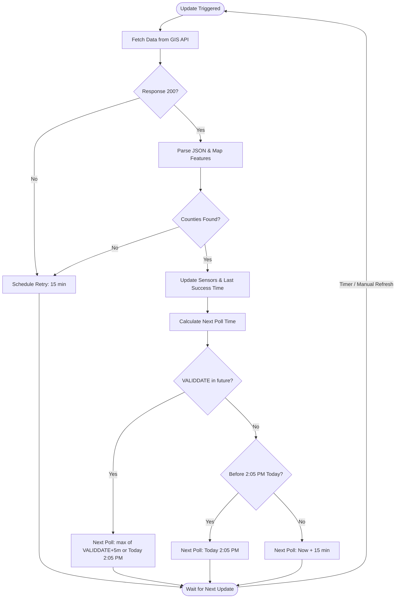

# Contributing to New BURNswick - NB Fire Watch

First off, thank you for considering contributing to this integration! It's people like you that make the Home Assistant community such a great place.

## How it works — Technical Logic

To minimize impact on the provincial GIS servers while maintaining 100% accuracy, this integration uses a "Split-Clock" logic:



### 1. Intelligent Polling (The Coordinator)
The integration does **not** poll every few minutes. Instead, it uses a combination of the API's `VALIDDATE` timestamp and the official provincial **2:00 PM Atlantic** update boundary:
- **Scheduled Sleep:** If the retrieved data is valid until a future time, the integration sleeps until **5 minutes after that expiration**, with a floor at **2:05 PM Atlantic**. This ensures that the `sensor` entities and the `image` entity update in synchronization, preventing stale maps from being included in status-change notifications.
- **Stale Data Retries:** If the server is late or the retrieved data is already expired, the integration targets the next **2:05 PM Atlantic** window. If it's already past 2:05 PM, it enters a **15-minute retry loop** until the next day's update is successfully received.
- **Manual Refresh:** You can still force an immediate update at any time using the **Refresh Data** button.

### 2. State Transitions (The Entities)
While the *status* (Red/Yellow/Green) officially updates at **2:00 PM**, the *permission* to burn (for Yellow status) changes at **8:00 PM** and **8:00 AM**.
- **No-Latency Transitions:** The `binary_sensor` handles these transitions internally using Home Assistant's local timers. 
- It does **not** call the API at 8 PM. It simply looks at the last-fetched status and flips its state locally, ensuring your automations trigger precisely on time without network delays.

## Development

This integration uses [uv](https://docs.astral.sh/uv/) for dependency management and local development.

### Setup

1. Install `uv`.
2. Sync the development environment:
   ```bash
   uv sync --dev
   ```

### Linting

Run [Ruff](https://docs.astral.sh/ruff/) to check for linting and formatting issues:
```bash
uv run ruff check .
uv run ruff format .
```

### Testing

Run [Pytest](https://docs.pytest.org/) to execute the test suite:
```bash
uv run pytest
```

## Commit Conventions

This project uses [Conventional Commits](https://www.conventionalcommits.org/en/v1.0.0/) to automate the release process and generate changelogs. Please use the following prefixes for your commits:

- `feat:` for new features (triggers a minor version bump)
- `fix:` for bug fixes (triggers a patch version bump)
- `docs:` for documentation changes
- `chore:` for maintenance tasks
- `refactor:` for code changes that neither fix a bug nor add a feature
- `test:` for adding or correcting tests

## Automated Releases

We use [release-please](https://github.com/googleapis/release-please) to manage our releases. When a `feat:` or `fix:` commit is merged into the `main` branch, an automated Release PR will be opened or updated. Merging this Release PR will:
1. Bump the version in `manifest.json` and `pyproject.toml`.
2. Update `CHANGELOG.md`.
3. Create a GitHub Tag and Release.
