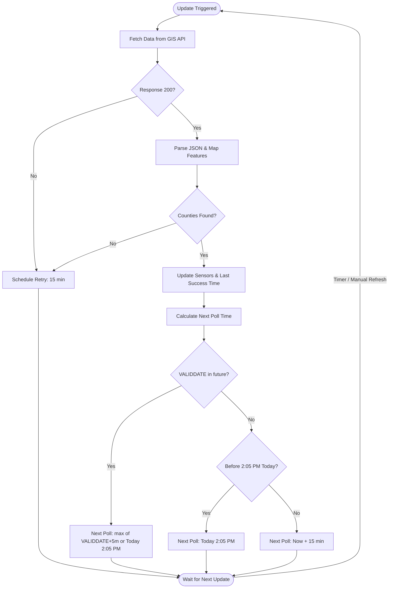

# New Brunswick Burn Ban Status

A [Home Assistant](https://www.home-assistant.io/) custom integration that tracks the provincial burn ban status for New Brunswick, Canada, sourced directly from the [GNB GIS REST API](https://gis-erd-der.gnb.ca/gisserver/rest/services/FireWeather/BurnCategories/MapServer/0).

## Features

- **Per-county burn ban status sensor** — reports `none`, `limited`, or `allowed` for each selected county, with status colour, human-readable description, and valid date as attributes.
- **Fire currently allowed binary sensor** — combines the burn ban status with the current Atlantic Time to report whether lighting a fire is permitted *right now*:
  - 🟢 **Green** (allowed) → always `on`
  - 🟡 **Yellow** (limited) → `on` between 8 PM and 8 AM Atlantic Time only
  - 🔴 **Red** (none) → always `off`
- **Raw API Attributes** — every county sensor and binary sensor includes an `api_attributes` attribute containing the raw JSON data for that specific county from the GIS server.
- **Burn ban map image entity** — displays the [provincial burn category map](https://www3.gnb.ca/public/fire-feu/maps/cat1.png).
- **Next update diagnostic sensor** — shows exactly when the next scheduled API poll will occur.
- **Multi-county selection** — pick one, several, or all counties during setup. Counties can be changed at any time via the integration's options flow.

## How it works — Technical Logic

To minimize impact on the provincial GIS servers while maintaining 100% accuracy, this integration uses a "Split-Clock" logic:



### 1. Intelligent Polling (The Coordinator)
The integration does **not** poll every few minutes. Instead, it uses a combination of the API's `VALIDDATE` timestamp and the official provincial **2:00 PM Atlantic** update boundary:
- **Scheduled Sleep:** If the retrieved data is valid until a future time, the integration sleeps until **5 minutes after that expiration**, with a floor at **2:05 PM Atlantic**. This ensures that the `sensor` entities and the `image` entity update in synchronization, preventing stale maps from being included in status-change notifications.
- **Stale Data Retries:** If the server is late or the retrieved data is already expired, the integration targets the next **2:05 PM Atlantic** window. If it's already past 2:05 PM, it enters a **15-minute retry loop** until the next day's update is successfully received.
- **Manual Refresh:** You can still force an immediate update at any time using the **Refresh Data** button.

### 2. State Transitions (The Entities)
While the *status* (Red/Yellow/Green) officially updates at **2:00 PM**, the *permission* to burn (for Yellow status) changes at **8:00 PM** and **8:00 AM**.
- **No-Latency Transitions:** The `binary_sensor` handles these transitions internally using Home Assistant's local timers. 
- It does **not** call the API at 8 PM. It simply looks at the last-fetched status and flips its state locally, ensuring your automations trigger precisely on time without network delays.

## Installation
...

### HACS (recommended)

1. Open HACS → **Integrations** → ⋮ → **Custom repositories**.
2. Add `https://github.com/travipross/new-brunswick-burn-ban-status` as an **Integration**.
3. Search for **New Brunswick Burn Ban Status** and install.
4. Restart Home Assistant.

### Manual

Copy the `custom_components/new_burnswick/` directory into your Home Assistant `config/custom_components/` folder and restart.

## Configuration

1. Go to **Settings → Devices & Services → Add Integration**.
2. Search for **New Brunswick Burn Ban Status**.
3. Select the counties you want to monitor (or choose **Select All**).

Options (county selection) can be updated at any time without reinstalling by clicking **Configure** on the integration card.

## Entities

For each selected county, the integration creates a device with the following entities:

| Entity | Type | Description |
|--------|------|-------------|
| `sensor.<county>_county_burn_ban_category` | Sensor | `allowed` / `limited` / `none` |
| `binary_sensor.<county>_county_burning_currently_allowed` | Binary Sensor | `on` if fire is permitted right now |

Plus shared provincial entities:

| Entity | Type | Description |
|--------|------|-------------|
| `image.new_brunswick_burn_ban_map` | Image | Provincial burn category map |
| `sensor.new_brunswick_next_burn_ban_data_update` | Sensor | Next scheduled API poll time |
| `button.new_brunswick_refresh_burn_ban_data` | Button | Manually trigger API refresh |

## Usage Example — RGB LED status indicator

You can drive an RGB bulb to reflect the current burn ban status using a state-triggered automation. Using the built-in `status_rgb` attribute makes this simple and ensures colours match the provincial standard:

```yaml
automation:
  - alias: "Burn ban LED indicator — York County"
    trigger:
      - platform: state
        entity_id: sensor.york_county_county_burn_ban_category
      - platform: homeassistant
        event: start
    action:
      - action: light.turn_on
        target:
          entity_id: light.your_rgb_bulb
        data:
          rgb_color: "{{ state_attr('sensor.york_county_county_burn_ban_category', 'status_rgb') }}"
          brightness: 200
```

| Sensor state | Colour | Meaning |
|---|---|---|
| `allowed` | 🟢 Green | Burning permitted at all times |
| `limited` | 🟡 Amber | Burning permitted 8 PM – 8 AM only |
| `none` | 🔴 Red | No burning permitted |
| `unknown` | ⚪ Grey | Data unavailable |

> **Tip:** Replace `sensor.york_county_county_burn_ban_category` and `light.your_rgb_bulb` with your actual entity IDs. For an at-a-glance current status, you can also use the `binary_sensor.<county>_county_burning_currently_allowed` entity to trigger notifications or other automations.

## Data Source

All data is sourced from the Government of New Brunswick's public GIS REST API and map service. This integration is not affiliated with or endorsed by the Government of New Brunswick.

## Development

This integration uses [uv](https://docs.astral.sh/uv/) for dependency management and local development.

### Setup

1. Install `uv`.
2. Sync the development environment:
   ```bash
   uv sync --dev
   ```

### Linting

Run [Ruff](https://docs.astral.sh/ruff/) to check for linting and formatting issues:
```bash
uv run ruff check .
uv run ruff format .
```

### Testing

Run [Pytest](https://docs.pytest.org/) to execute the test suite:
```bash
uv run pytest
```
